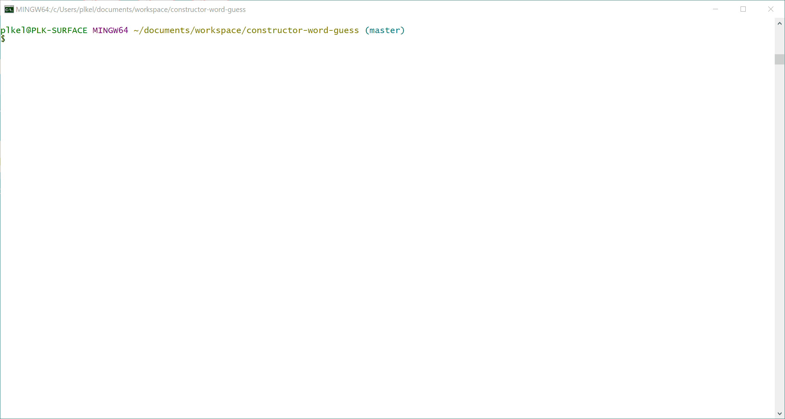

# Advanced JavaScript Assignment: Constructor Word Guess
Advanced JavaScript Homework #9

## Overview
Create a Word Guess command-line game using constructor functions.

### Features
The Word Guess game contains the following files and features:
1. `letter.js`
  * Contains a constructor, Letter, with a string (letter) and a boolean (guessed) value.
  * Letter contains a function that returns either an underlying letter or an underscore, based on whether the game letter has been guessed.
  * Letter contains a function that takes the user's guess as an argument and checks it against the underlying letter, setting the letter's guessed value to true if the letter was guessed correctly.
2. `word.js`
  * Contains a constructor, Word that depends on the Letter constructor, that creates an array containing each letter of the game word the user is attempting to guess.
  * Word contains a function that calls displayWord() function, which concatenates a string representing the game word, calling the display() function defined in `letter.js` on each letter object and displaying guessed letters or an underscore for unguessed letters.
  * Word contains a function that takes a user guess as an argument and calls the guessWord function on each letter object, calling the check() function defined in `letter.js` and setting the letter's guessed value to true when the letter is guessed correctly.
3. `index.js`
  * Containing the logic for the game and depends on `word.js`.
  * Randomly selects a game word from an array of words.
  * Uses the `Word` constructor to store the game word.
  * Prompts the user their guess on the game word letters.
  * Tracks the user's remaining guesses, subtracting a guess each time the user guesses incorrectly.
  * The game ends if the user runs out of guesses (10) or the user guesses all of the game letters before they run out of guesses.
  * A new game starts automatically after a win or loss.

### Technologies Used
  * Node JS v12.13.0
  * Inquirer Node Package Manager (NPM) v7.0.4"

### Using Constructor Word Guess
The Word Guess game is launched by running "node index" on the command line.

### Word Guess Results
Constructor Word Guess is a command line application; accordingly, it cannot be run in a web browser.  See below for a video demonstrating the working application. 

## Completed Assignment

### Due
Sunday, February 23, 2020

### Student
Pam Kelly at [esq.kelly@gmail.com](mailto:esq.kelly@gmail.com)

Full-Stack Coding Bootcamp through UCB Extension

### Completed Assignment URLs
#### Github repository
[Github Link](https://github.com/PLKGIT/constructor-word-guess) at https://github.com/PLKGIT/constructor-word-guess
#### Display Results
[README Link](https://plkgit.github.io/constructor-word-guess/) at https://plkgit.github.io/constructor-word-guess/
#### Word Guess on Portfolios
[Professional Porfolio](https://www.pamkelly.com/portdev.html) at https://www.pamkelly.com/portdev.html
[Bootstrap Portfolio](https://plkgit.github.io/Bootstrap-Portfolio/portfolio.html) at https://plkgit.github.io/Bootstrap-Portfolio/portfolio.html

Copyright &copy; 2020 Pamela L. Kelly